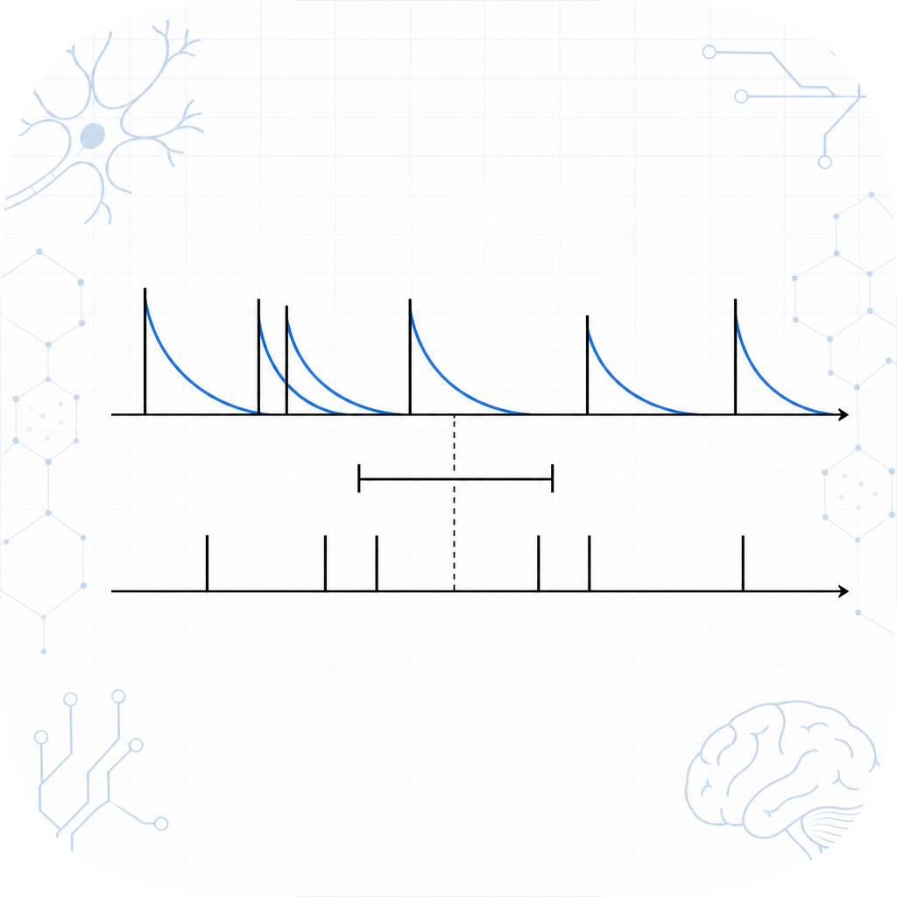

# spikedist

<p align="center">
  
</p>

[](https://pypi.org/project/spikedist/)
[](https://github.com/amaar-mc/spikedist/actions/workflows/ci.yml)
[](./LICENSE)

Spike-train distance and similarity metrics in pure Python with zero dependencies. Implements the Victor-Purpura and van Rossum distances and the Schreiber and Hunter-Milton similarities on plain sequences of spike times.

## Install

```sh
pip install spikedist
```

## 30-second example

```python
from spikedist import victor_purpura, van_rossum, schreiber, hunter_milton

a = [0.010, 0.025, 0.090]   # spike times in seconds
b = [0.012, 0.030, 0.095]

victor_purpura(a, b, cost=100.0)  # edit distance, cost is the q parameter
van_rossum(a, b, tau=0.012)       # kernel distance, tau is the time constant
schreiber(a, b, sigma=0.010)      # Gaussian correlation similarity in [0, 1]
hunter_milton(a, b, tau=0.012)    # nearest-neighbor similarity in (0, 1]
```

Spike times can be Python lists, tuples, or any sequence of numbers, including
NumPy arrays. They are treated as an unordered set of event times and sorted
internally. There is no NumPy requirement.

## Why this exists

The Victor-Purpura and van Rossum distances are two of the most cited spike-train
metrics, but every Python implementation lives inside a heavy framework or a
compiled extension:

- `elephant` implements both, but requires `neo` and `quantities` and works on
  `neo.SpikeTrain` objects with units.
- `pymuvr` is a fast multi-unit van Rossum implementation, but is a C++ extension
  and requires NumPy.
- `pyspike` is excellent for ISI-distance, SPIKE-distance, and SPIKE-synchrony,
  but does not implement Victor-Purpura or van Rossum.

`spikedist` is a small, typed, dependency-free package for when you just want the
distance between two spike trains.

## Definitions

### Victor-Purpura

`victor_purpura(a, b, *, cost)` is the minimum total cost to turn train `a` into
train `b` using three operations: insert a spike (cost 1), delete a spike
(cost 1), and shift a spike by `dt` (cost `cost * abs(dt)`). `cost` is the
parameter usually written `q`. It is computed with an O(n*m) dynamic program.

- `cost = 0` counts only the difference in spike count.
- As `cost` grows, shifting becomes expensive and each unmatched spike approaches
  a cost of 2.

### van Rossum

`van_rossum(a, b, *, tau)` convolves each train with a causal exponential kernel
`exp(-t / tau)` and returns the Euclidean distance between the filtered signals.
Using the closed form of the kernel inner products,

```
D^2 = 0.5 * (Saa + Sbb - 2 * Sab),  Sxy = sum over spike pairs exp(-|xi - yj| / tau)
```

The kernel sums are computed in O(n + m) time using the Houghton-Kreuz markage
recursion rather than the naive O(n*m) double loop.

With this normalization the distance between an empty train and a single spike is
`sqrt(0.5)`, and as `tau` grows large the distance approaches
`abs(len(a) - len(b)) / sqrt(2)`.

Both distances are true metrics: non-negative, symmetric, zero only between equal
trains, and they satisfy the triangle inequality. These properties are tested.

### Multi-unit van Rossum

`van_rossum_multiunit(a, b, *, tau, c)` compares two labeled populations of spike trains,
each given as a mapping from unit label to that unit's train. The parameter `c` in
`[0, 1]` sets how much spikes of different units interact: `c = 0` treats the units as
independent (the Euclidean combination of the per-unit distances), `c = 1` ignores the
labels (the pooled van Rossum distance), and a single unit reduces to `van_rossum`. It
reuses the O(n + m) markage cross-sum.

### Schreiber similarity

`schreiber(a, b, *, sigma)` convolves each train with a Gaussian of width `sigma`
and returns the cosine similarity of the filtered signals, in `[0, 1]`. It is 1
for identical trains.

### Hunter-Milton similarity

`hunter_milton(a, b, *, tau)` scores each spike by `exp(-dt / tau)` to its nearest
neighbor in the other train and averages over both trains, giving a value in
`(0, 1]`. It is 1 for identical trains.

By convention both similarities treat two empty trains as identical (1.0) and a
non-empty train against an empty one as fully dissimilar (0.0).

### Pairwise matrices

`pairwise(trains, metric)` builds the full matrix of any metric over a list of
trains. Parameterize the metric with `functools.partial`:

```python
from functools import partial
from spikedist import pairwise, van_rossum

pairwise(trains, partial(van_rossum, tau=0.01))
```

## Roadmap

- Multi-unit van Rossum.
- Fast O(n) van Rossum via the Houghton-Kreuz markage recursion.
- An optional NumPy fast path for large pairwise computations.

## Testing

```sh
pip install -e ".[dev]"
pytest
```

Tests cover exact closed-form reference values and metric-property invariants
(identity, symmetry, non-negativity, triangle inequality) via Hypothesis.

## Contributing

Issues and pull requests are welcome. See [CONTRIBUTING.md](./CONTRIBUTING.md).

## License

MIT. See [LICENSE](./LICENSE).
